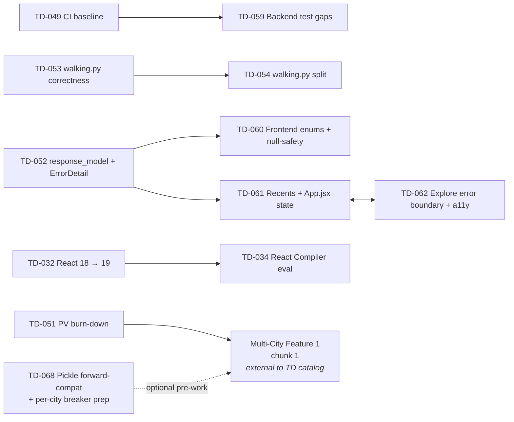

# Technical Debt Payoff Roadmap

Dependency map + parallel-safe lanes for the open items in [`Technical_Debt.md`](Technical_Debt.md). The catalog itself stays the source of truth for scope, acceptance, and findings; this file only sequences the work.

> **What this is:** a directed-dependency view + parallelism cheat-sheet so multiple sessions (or one session across multiple sittings) can pick the next safe chunk without re-deriving the constraints each time.
>
> **What this isn't:** a milestone calendar or effort estimate. No dates, no S/M/L sizing. Order chunks ad-hoc as time allows, respecting only the dependencies below.

## Legend

- 🔴 High / 🟡 Medium / 🟢 Low priority (mirrors the catalog).
- **Hard dep**: A must land before B or B will break or be blocked.
- **Soft dep**: A and B touch the same file(s); land sequentially or coordinate to avoid merge thrash. Doesn't change correctness, just reduces friction.
- **Parallel-safe**: Different files, no shared state — fire-and-forget across sessions.

## Dependency graph (hard deps only)

If Mermaid doesn't render, the same edges as text:

- `TD-049 → TD-059`
- `TD-053 → TD-054`
- `TD-052 → TD-060` (parts: C-01, C-03, C-04, C-10, C-17)
- `TD-052 → TD-061` (parts: C-14, C-15)
- `TD-061 ↔ TD-062` (paired, land together)
- `TD-032 → TD-034`
- `TD-051 → Multi-City Feature 1 chunk 1` (Feature is external; called out because TD-051 is the gate)
- `TD-068 → Multi-City Feature 1 chunk 1` (optional front-loading)

## Hard dependencies

| Predecessor | Successor | Why |
|-------------|-----------|-----|
| TD-049 | TD-059 | TD-059's perf-test gate runs in CI; CI must exist first. |
| TD-053 | TD-054 | TD-053 adds tests + correctness fixes to `walking.py`; TD-054 then splits the module. Doing the split first leaves the new tests landing in a moving target. |
| TD-052 | TD-060 (partial) | `FLAVOR_META`, `PLACE_SOURCES`, etc. on the frontend need stable enum definitions; the cleanest source is the new Pydantic models. Without TD-052, frontend enums duplicate string literals that the backend may still rename. |
| TD-052 | TD-061 (partial) | C-14 (recents keyed off backend-normalized stops) and C-15 (arrival-footer when directions empty) both rely on the response shape stabilizing first. |
| TD-061 | TD-062 (paired) | Both touch `App.jsx` and have explicit "land alongside" notes in the catalog. Treat as one PR or two PRs cut from the same branch. |
| TD-032 | TD-034 | React Compiler is a React 19-only feature. |

## Soft dependencies (file overlap — sequence to avoid conflicts)

| Items | Shared surface | Recommended order |
|-------|----------------|-------------------|
| TD-053 / TD-054 / TD-068 | `backend/walking.py` | TD-053 (correctness + tests) → TD-054 (split) → TD-068 (relax fail-fast guard in the new module). TD-053 → TD-054 is hard; TD-054 → TD-068 is soft. |
| TD-055 / TD-056 / TD-067 | `backend/main.py`, `backend/geocoding.py` | Any order, but rebase carefully — TD-055 refactors geocoding tiers, TD-056 adds lifespan cleanup, TD-067 adds security-header + validator changes in `main.py`. |
| TD-060 / TD-061 / TD-062 / TD-063 / TD-065 | `frontend/src/App.jsx` | App.jsx is a hotspot. Land TD-061 + TD-062 together first (the high-priority pair), then TD-060, then TD-063 / TD-065 (both 🟢 Low). |
| TD-046 / TD-058 | docs ↔ ingest output drift | TD-046 verifies docs against ingest artifacts; if TD-058 lands first, TD-046 has a cleaner target. Either order works. |
| TD-050 / TD-049 | release pipeline ↔ CI | TD-049's CI baseline can host TD-050's `ARTIFACT_REV` guard check as a workflow step. Land TD-049 first if combining them. |

## Parallel-safe lanes

Within each wave, items in the same row can run in different sessions without coordination beyond the soft-dep table above.

| Wave | Parallel-safe set | Notes |
|------|-------------------|-------|
| 0 | TD-045, TD-046, TD-047 | Different files. Pure docs / governance / dev tooling. |
| 1 | TD-048, TD-049, TD-050, TD-051 | TD-051 is human-driven (device + key access); the other three are code-light. |
| 2 | TD-052 ∥ TD-055 ∥ TD-056 ∥ TD-057 ∥ TD-058 ∥ TD-059 | TD-053 → TD-054 sequential; everything else parallel. TD-059 waits on TD-049. TD-052 unblocks portions of Wave 3. |
| 3 | (TD-061 + TD-062) → TD-060 → TD-063 ∥ TD-064 ∥ TD-065 ∥ TD-066 | App.jsx hotspot — see soft-dep table. TD-064 / TD-066 touch other files and can run alongside. |
| 4 | TD-067 | Standalone. Can run in parallel with any wave. |
| 5 | TD-068, TD-069, TD-070, TD-071 | All independent. TD-068 lightly intersects `walking.py` (do after TD-054 if both are planned in the same window). |
| 6 | TD-072, TD-032, TD-034, TD-044 | All optional / paused — see next section. |

## Outside-the-audit-batch items

These four exist in the catalog but sit outside the Wave 0–6 map. Slot them as follows.

### TD-032 · React 18 → 19

Has its own internal 8-chunk plan (lines 615–654 of [`Technical_Debt.md`](Technical_Debt.md)). Chunks 1–6 are desktop / code-only and can run any time after a clean baseline is captured. Chunk 7 is the mobile-device gate (user-driven). **Recommended slot:** after Wave 3 settles, so the frontend isn't simultaneously absorbing the App.jsx hotspot work *and* a React major. Hard-dep into TD-034.

### TD-034 · React Compiler opt-in

Blocked on TD-032. Optional after it — no other TD depends on it.

### TD-044 · ShareDispatch inline-style + CSP `style-src`

Standalone. No deps in or out. Needs a visual-diff loop on the share-card PNG; **recommended slot:** alongside whatever next share-card / share-modal feature work lands, since the visual-diff rig will already be in hand.

### TD-072 · CSS modularization

Optional polish, no deps. The catalog itself says "skip unless `App.css` crosses ~4K lines." Don't pull this in proactively.

## Recommended entry points (zero blockers)

If you're picking up the next chunk and don't want to think about deps, any of these can start immediately:

- **🔴 High, fast:** TD-045 (LICENSE), TD-046 (doc drift sweep), TD-050 (artifact pipeline guardrails).
- **🔴 High, deeper:** TD-052 (response models — unlocks Wave 3), TD-053 (walking.py correctness — unlocks TD-054), TD-051 (PV burn-down — unlocks Multi-City).
- **Standalone:** TD-067 (security headers), TD-069 (structured logging), TD-070 (DR runbook), TD-071 (localStorage versioning), TD-047 (dev-tunnel resolution).

## Chunk completion checklist

When a TD chunk lands (PR merged), update the following before considering the work done:

1. **Catalog** — Delete the TD-XXX entry from [`Technical_Debt.md`](Technical_Debt.md). The catalog only contains unresolved debt.
2. **History** — Add a resolution entry to [`archive/RESOLVED_HISTORY.md`](archive/RESOLVED_HISTORY.md) under "Technical Debt Paid Off": what changed, which files moved, any departures from the catalog's planned scope.
3. **This roadmap** — Remove the node from the Mermaid graph and the text-fallback edge list, delete rows referencing the chunk from the Hard / Soft dep tables, and update the Parallel-safe lanes if a wave is now empty. If a hard-dep edge resolves (e.g. TD-052 lands and the C-* dependencies in Wave 3 unblock), strike the edge from both representations.
4. **CLAUDE.md** — Update if the change altered "Key Design Decisions", the project tree comments, or any runbook surface (the greenest-routing release runbook for `walking.py` / `fetch_street_graph.py` changes; the geocoding cascade description for `geocoding.py` changes; etc.).
5. **README.md** — Update if the change touched API shape, environment variables, setup steps, or anything else the README documents.
6. **docs/Pending_Verification.md** — If a PV item was verified alongside the chunk, check it off (and move resolved PV entries per that file's own process note).
7. **Per-chunk acceptance** — Re-read the catalog entry's Scope / Acceptance lines before marking the chunk done; many entries already enumerate doc updates explicitly (TD-054 requires a CLAUDE.md update; TD-046 *is* a doc-drift sweep; TD-058 lands a new ingest pattern that ripples into the project tree).

A new audit batch landing new TD-XXX entries is the other update trigger — fold them into the graph and tables here when they're catalogued.

**Roadmap upkeep window:** if this file falls more than one resolved item behind the catalog, the dep graph is no longer trustworthy — reconcile it before consulting it for sequencing.
