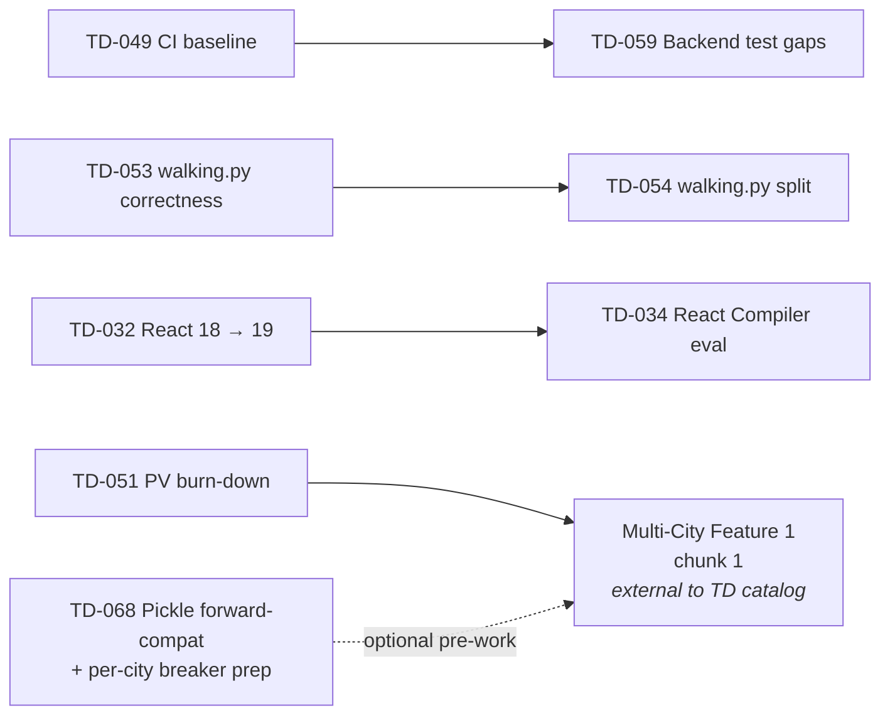

# Technical Debt Payoff Roadmap

Dependency map + parallel-safe lanes for the open items in [`Technical_Debt.md`](Technical_Debt.md). The catalog itself stays the source of truth for scope, acceptance, and findings; this file only sequences the work.

> **What this is:** a directed-dependency view + parallelism cheat-sheet so multiple sessions (or one session across multiple sittings) can pick the next safe chunk without re-deriving the constraints each time.
>
> **What this isn't:** a milestone calendar or effort estimate. No dates, no S/M/L sizing. Order chunks ad-hoc as time allows, respecting only the dependencies below.

## Legend

- 🔴 High / 🟡 Medium / 🟢 Low priority (mirrors the catalog).
- **Hard dep**: A must land before B or B will break or be blocked.
- **Soft dep**: A and B touch the same file(s); land sequentially or coordinate to avoid merge thrash. Doesn't change correctness, just reduces friction.
- **Parallel-safe**: Different files, no shared state — fire-and-forget across sessions.

## Dependency graph

Hard deps are solid arrows; the dotted edge from TD-068 is optional pre-work. External feature gates (the Multi-City callout) are included for visibility because TD-051 / TD-068 are sequenced against them.

If Mermaid doesn't render, the same edges as text:

- `TD-049 → TD-059`
- `TD-053 → TD-054`
- `TD-032 → TD-034`
- `TD-051 → Multi-City Feature 1 chunk 1` (Feature is external — scoped in [`FEATURE_PLANS.md`](FEATURE_PLANS.md) "Multi-City Support"; called out because TD-051 is the gate)
- `TD-068 → Multi-City Feature 1 chunk 1` (optional front-loading; same external feature as above)

## Hard dependencies

| Predecessor | Successor | Why |
|-------------|-----------|-----|
| TD-049 | TD-059 | TD-059's perf-test gate runs in CI; CI must exist first. |
| TD-053 | TD-054 | TD-053 adds tests + correctness fixes to `walking.py`; TD-054 then splits the module. Doing the split first leaves the new tests landing in a moving target. |
| TD-032 | TD-034 | React Compiler is a React 19-only feature. |
| TD-049 | TD-050 *(conditional)* | Only hard if TD-050's `ARTIFACT_REV` guard ships as a workflow step inside the TD-049 CI baseline. If TD-050 lands as a standalone script, no dep. See the soft-dep row below for the combined case. |

## Soft dependencies (file overlap — sequence to avoid conflicts)

| Items | Shared surface | Recommended order |
|-------|----------------|-------------------|
| TD-053 / TD-054 / TD-068 | `backend/walking.py` | TD-053 (correctness + tests) → TD-054 (split) → TD-068 (relax fail-fast guard in the new module). TD-053 → TD-054 is hard; TD-054 → TD-068 is soft. |
| TD-055 / TD-056 / TD-067 | `backend/main.py`, `backend/geocoding.py` | Any order, but rebase carefully — TD-055 refactors geocoding tiers, TD-056 adds lifespan cleanup, TD-067 adds security-header + validator changes in `main.py`. |
| TD-065 | `frontend/src/App.jsx` | App.jsx is a hotspot. TD-060 / TD-061 / TD-062 / TD-063 landed 2026-05-24. |
| TD-050 / TD-049 | release pipeline ↔ CI | TD-049's CI baseline can host TD-050's `ARTIFACT_REV` guard check as a workflow step. Land TD-049 first if combining them. |

## Parallel-safe lanes

Within each wave, items in the same row can run in different sessions without coordination beyond the soft-dep table above.

| Wave | Parallel-safe set | Notes |
|------|-------------------|-------|
| 0 | TD-045 | TD-046 + TD-047 resolved 2026-05-24; TD-045 remains as the lone Wave 0 item. |
| 1 | TD-048, TD-049, TD-050, TD-051 | TD-051 is human-driven (device + key access); the other three are code-light. |
| 2 | TD-055 ∥ TD-056 ∥ TD-057 ∥ TD-058 ∥ TD-059 | TD-053 → TD-054 sequential; everything else parallel. TD-059 waits on TD-049. TD-052 resolved 2026-05-24 — Wave 3 is no longer gated. |
| 3 | — | All Wave 3 items landed 2026-05-24. |
| 4 | — | TD-067 landed 2026-05-24. |
| 5 | TD-068, TD-069, TD-070, TD-071 | Independent of each other. **TD-068 has a soft dep on TD-054 (Wave 2)** — both touch `walking.py`; land TD-068 after TD-054 if both are planned in the same window. |
| 6 | TD-072, TD-032, TD-034, TD-044 | All optional / paused. TD-032 / TD-034 / TD-044 predate the audit batch — see [Wave 6 details (paused / optional items)](#wave-6-details-paused--optional-items) below before pulling them. |

## Wave 6 details (paused / optional items)

Wave 6 holds four catalog entries that share a "paused / optional polish" profile. **TD-072** is the audit-batch member (CHUNK-28); **TD-032, TD-034, TD-044** predate the 2026-05-23 audit and are slotted here for visibility. Pull-order guidance for each:

### Pre-audit carryovers

#### TD-032 · React 18 → 19

Has its own internal 8-chunk plan (the *Chunked execution plan* block under the TD-032 entry in [`Technical_Debt.md`](Technical_Debt.md)). Chunks 1–6 are desktop / code-only and can run any time after a clean baseline is captured. Chunk 7 is the mobile-device gate (user-driven). **Recommended slot:** after Wave 3 settles, so the frontend isn't simultaneously absorbing the App.jsx hotspot work *and* a React major. Hard-dep into TD-034.

#### TD-034 · React Compiler opt-in

Blocked on TD-032. Optional after it — no other TD depends on it.

#### TD-044 · ShareDispatch inline-style + CSP `style-src`

Standalone. No deps in or out. Needs a visual-diff loop on the share-card PNG; **recommended slot:** alongside whatever next share-card / share-modal feature work lands, since the visual-diff rig will already be in hand.

### Audit-batch deferral

#### TD-072 · CSS modularization

Optional polish, no deps. The catalog itself says "skip unless `App.css` crosses ~4K lines." Don't pull this in proactively.

## Recommended entry points (zero blockers)

If you're picking up the next chunk and don't want to think about deps, any of these can start immediately. The buckets are cross-cutting (priority × session-shape), not mutually exclusive — pick the row that matches the session you have.

- **🔴 High, fast:** TD-045 (LICENSE), TD-050 (artifact pipeline guardrails).
- **🔴 High, deeper:** TD-053 (walking.py correctness — unlocks TD-054), TD-051 (PV burn-down — unlocks Multi-City; **human-driven**, needs device + LocationIQ key access).
- **Standalone (any priority, no coordination needed):** TD-045, TD-067 (security headers), TD-069 (structured logging), TD-070 (DR runbook), TD-071 (localStorage versioning).

## Chunk completion checklist

When a TD chunk lands (PR merged), update the following before considering the work done:

1. **Catalog** — Delete the TD-XXX entry from [`Technical_Debt.md`](Technical_Debt.md). The catalog only contains unresolved debt.
2. **History** — Add a resolution entry to [`archive/RESOLVED_HISTORY.md`](archive/RESOLVED_HISTORY.md) under "Technical Debt Paid Off": what changed, which files moved, any departures from the catalog's planned scope.
3. **This roadmap** — Remove the node from the Mermaid graph and the text-fallback edge list, delete rows referencing the chunk from the Hard / Soft dep tables, and update the Parallel-safe lanes if a wave is now empty. If a hard-dep edge resolves (e.g. TD-052 lands and the C-* dependencies in Wave 3 unblock), strike the edge from both representations.
   - *Example — TD-052 lands:* delete the `TD-052 → TD-060` and `TD-052 → TD-061` arrows from the Mermaid block and the text-fallback list; remove both rows from the Hard dependencies table; strike the "Gated on TD-052 from Wave 2" clause from the Wave 3 cell; drop the "Pull TD-052 first" recommendation from the Wave 2 cell.
   - *Example — wave empties:* if the last item in Wave 4 lands (TD-067 alone), remove the Wave 4 row from the Parallel-safe lanes table entirely rather than leaving an empty cell.
4. **CLAUDE.md** — Update if the change altered "Key Design Decisions", the project tree comments, or any runbook surface (the greenest-routing release runbook for `walking.py` / `fetch_street_graph.py` changes; the geocoding cascade description for `geocoding.py` changes; etc.).
5. **README.md** — Update if the change touched API shape, environment variables, setup steps, or anything else the README documents.
6. **docs/Pending_Verification.md** — If a PV item was verified alongside the chunk, check it off (and move resolved PV entries per that file's own process note).
7. **Per-chunk acceptance** — Re-read the catalog entry's Scope / Acceptance lines before marking the chunk done; many entries already enumerate doc updates explicitly (TD-054 requires a CLAUDE.md update; TD-058 lands a new ingest pattern that ripples into the project tree).

A new audit batch landing new TD-XXX entries is the other update trigger — fold them into the graph and tables here when they're catalogued.

**Roadmap upkeep window:** if this file falls more than one resolved item behind the catalog, the dep graph is no longer trustworthy — reconcile it before consulting it for sequencing.

**Before picking up the next chunk:** re-read this roadmap end-to-end (it's short on purpose). The checklist above edits the file but doesn't replace reading it — a session that opens the catalog without checking the dep graph here is exactly how stale sequencing decisions get made.
